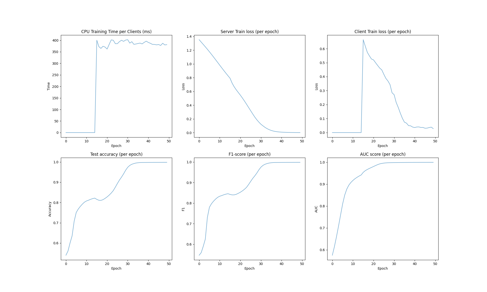
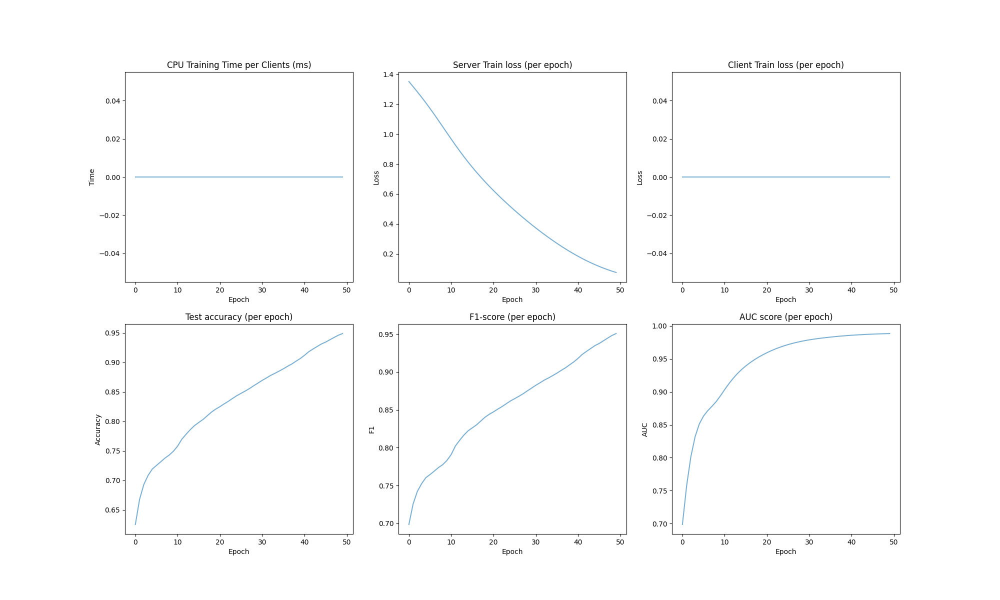
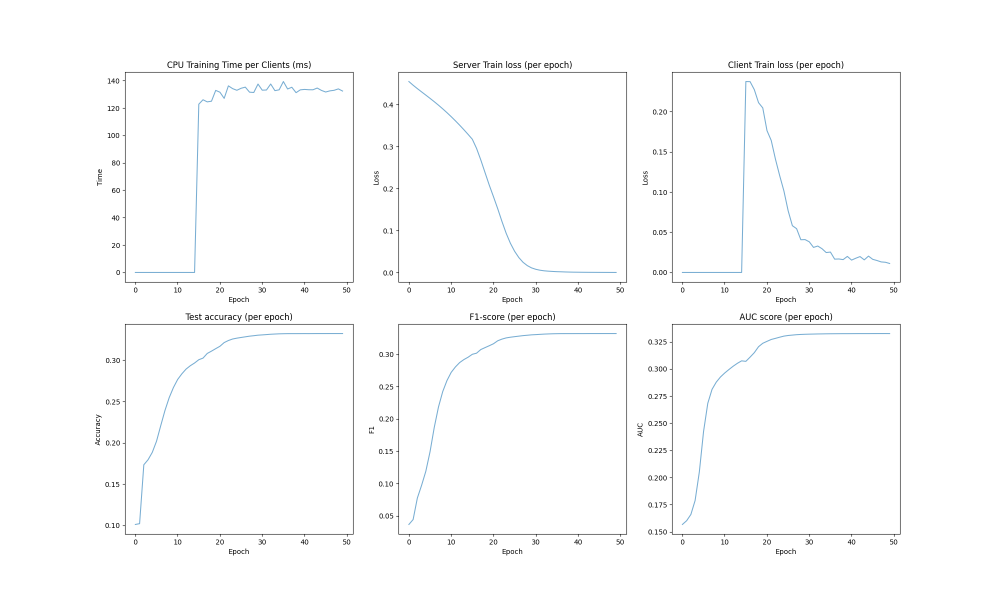
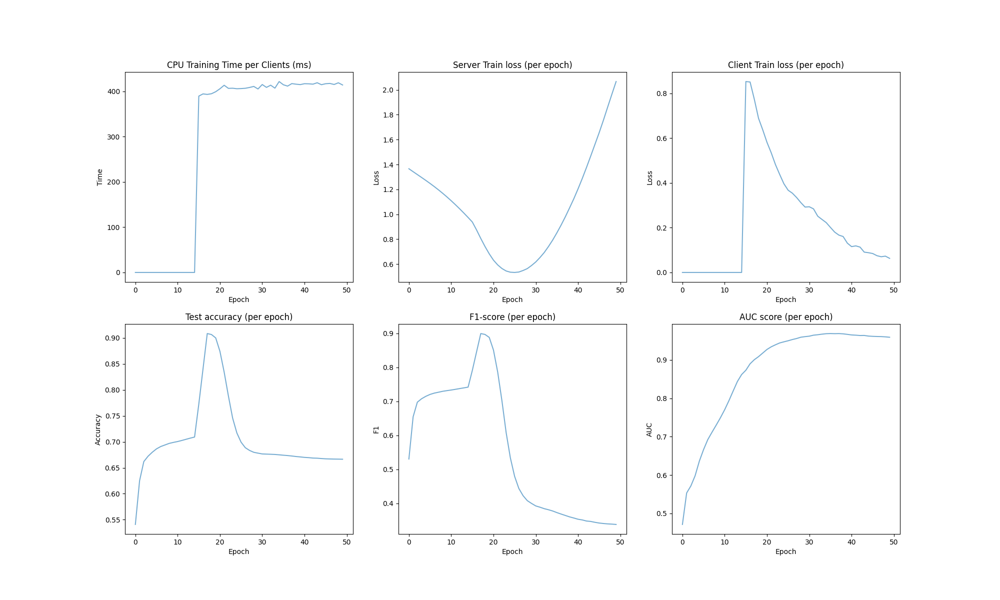
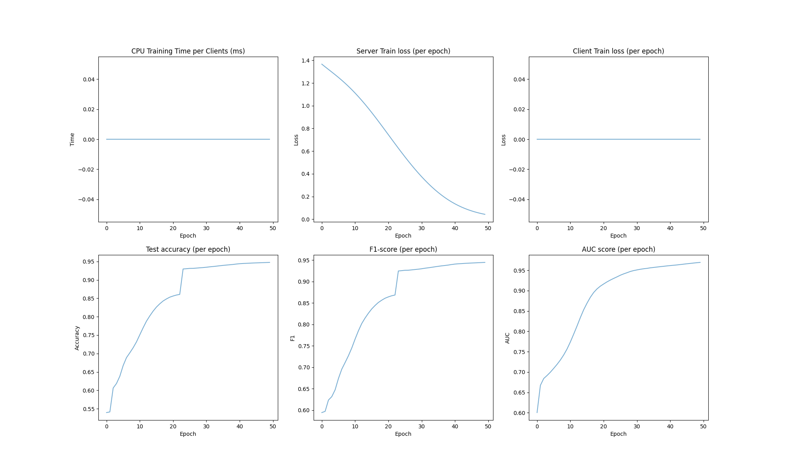

# FedSSL Framework on N-BaIoT datset

This report is the experiment analysis of federated semi-supervised learning framework on N-BaIoT dataset.

## Framework Introduction

Our federated semi-supervised learning framework aims to set up a distributed ML baseline for IoT device scenarios. 
In this scenario, we assumes assumes that labels are only available at the server, while local clients/devices work with only unlabeled data. 
In the server side of our framework, we use the Cross-Entropy loss to train the model on the server data.
In the client side, we first utilize the pseudo labelling technique to generate the fake annotation for the unlabeled dataset and then train the model based on the pseudo labels.

## Hyperparameter Setting 

To begin with, I'rd like to introduce a few important parameters:

- epoch: the total communication round of model training.
- init_epochs: we will skip the client-side training in the begin of training.
- label_rate: the ratio of labeled data and the unlabeled data. Notices that the data size in server and clients will depends on label_rate.
- num_users: the number of clients in total.
- frac: the ratio of selected clients in each round client traning
- local_ep: the number of training epochs in each client training.
- iid: iid if the data distribution in the clients is same, noniid otherwise.
- threshold: the threshold of pseudo label generation, when the predicted probability is greater than the threshold, we generate the pseudo annotation.

More hyperparameters is available on the /utils/options.py.

## Evaluation Setting

For the evaluation, we evaluate the metric below for each coummuncation round:

- cpu training time per clients (ms)
- cross-entropy loss on the server traning
- average of cross-entropy loss on the client traning
- accuracy on the testset
- f1-score on the testset
- auc-score on the testset

For all the experiment below, we report the experiment for three times and take the average.

## Main Experiment

In the main experiment, we compare our FedSSL framework with simple server training with labeled data.

### IID setting

|  |Accuracy | F1 score|AUC score|
|---    |---  |---   |---   |
|FedSSL| 99.05%  | 0.98  |  1.00 |   
|non FL   |  94.34% | 0.94  | 0.97  |

The results of our framework:

The results of non FL framework:

### Non-IID setting

|  |Accuracy | F1 score|AUC score|
|---    |---  |---   |---   |
|FedSSL|  98.69% | 0.97 | 1.00  |   
|non FL   |  93.54% | 0.92  | 0.95  |

The results of our framework:

The results of our framework if collapses:

The results of non FL framework:

## Ablation Study

- label_rate

|accuracy|0.01 | 0.001|0.0001|
|---    |---  |---   |---   |
|iid    |  99.88% | 99.05%  | 81.04%  |
|non-iid| 99.69%  | 98.69%  |  63.45% |   

|f1-score|0.01 | 0.001|0.0001|
|---    |---  |---   |---   |
|iid    |  1.00 |  0.98 |  0.84 |   
|non-iid|  1.00 |   0.97| 0.73  |   

- num_users

|accuracy|50 | 100|200|
|---    |---  |---   |---   |
|iid    |  99.87% | 99.05%  | 93.60%  |   
|non-iid| 92.13% (50.00%; collapse eventually)  |  98.69% | 94.70%  |   

- local_ep

|accuracy|1 | 2|5|
|---    |---  |---   |---   |
|iid    | 73.56%  | 73.56%  |  99.05% |   
|non-iid|  91.47% |  82.54% (53.49%; collapse eventually) |  98.69% |   

|CPU time|1 | 2|5|
|---    |---  |---   |---   |
|iid    |  219.6ms |  258.3ms |  373.1ms | 
|non-iid|  211.4ms | 278.3ms  |  401.3ms |  

- init_epochs

|accuracy|0 | 10 | 15| 30|
|---    |---  |---   |---   |---   |
|iid    |  75.96% |  84.65% | 99.05%  | 99.49%  |
|non-iid|  91.03% (50.31%; collapse eventually) |  99.36% | 98.69%  | 91.09%  |

|f1-score|0 | 10 |15| 30 |
|---    |---  |---   |---   |---   |
|iid    |  0.79 |  0.86 |  0.98 |  1.0 |  
|non-iid|  0.90 (0.00) |  1.00 |  0.97 |  0.96 |   

- threshold

|accuracy| 0.7 | 0.9| 0.95|
|---    |---   |---   |---   |
|iid     |  99.05% | 82.18% | 81.86%  |
|non-iid|  98.69% | 90.51% (collapse eventually)  | 92.19% (collapse eventually)  | 
